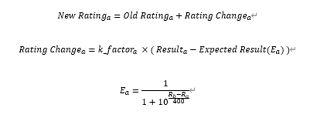

# Elo

Elo Algorithm implementation in Go.

# Formula

## K factors
- default K
- Streak K

### default K
k = 60

### Streak K
c = number of consequtive wins/loses

k = $2^{c+1}$

## Result
| type | Result Value |
| --- | --- |
| Win | 1 |
| Draw | 0.5 |
| Lose | 0 |

## Exprected Result
$E_a = \frac{1}{1 + 10^{\frac{R_b - R_a}{400}}}$

$E_b = 1 - E_a$

- $R_a$: Player A Elo Score
- $R_b$: Player B Elo Score
- $E_a$ will be rounded down to the second decimal place
- $E_a + E_b$ should be always 1
- Default Elo score is 1500

## Ref
- [Wikipedia: Elo Rating System](https://en.wikipedia.org/wiki/Elo_rating_system)
- [세션 게임의 매치메이킹 알고리즘](https://medium.com/rate-labs/%EC%84%B8%EC%85%98-%EA%B2%8C%EC%9E%84%EC%9D%98-%EB%A7%A4%EC%B9%98%EB%A9%94%EC%9D%B4%ED%82%B9-%EC%95%8C%EA%B3%A0%EB%A6%AC%EC%A6%98-c29989ddadcc)